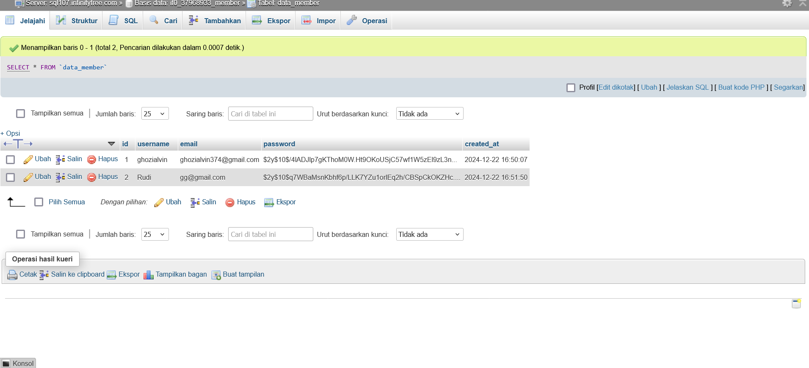

# Ghozialvin-UAS-Pemweb

# Ujian Akhir Semester ( Pemrograman Web)

> Nama : Ghozi Alvin Karim \
> Nim : 121450123 \
> Program Studi : Sains Data \
> Mata Kuliah : Pemrograman Web (RB)

## 📍 Introduction
Repository  ini merupakan sebuah Repository untuk **Ujian Akhir Semester Pemrograman Web**. Pada Repository menampilkan sebuah halaman website untuk pendaftaran *Member Gym*.

---
### Explanation Regarding Flow

1. Halaman Login Web \
Pada Halaman Login ini **User** yang sudah mempunyai akun atau terdafatar pada *GYM* akan bisa logi,Sedangakan yang belum terdafatar harus mendaftarkan diri sebagai member *GYM*. Akun User yang login harus sesuai dengan pada data yang telah di daftarkan agar bisa login.

2. Halaman Sing Up 
Page ini merupakan tampilan untuk user yang sudah terdaftar dan sudah punya akun.Kemudian user diminta untuk login untuk masuk.\

3. Halaman Display Data 
Page ini merupakan tampilan untuk data siapa saja user atau member yang terdaftar. 

### Database Explanation

Gambar ini merupakan tampilan databse sql pada table member

### Hosting Step

* Open https://www.infinityfree.com
* Link Website [UASPEMWEB](http://uaspemwebalvin.ct.ws/Login.php) 
